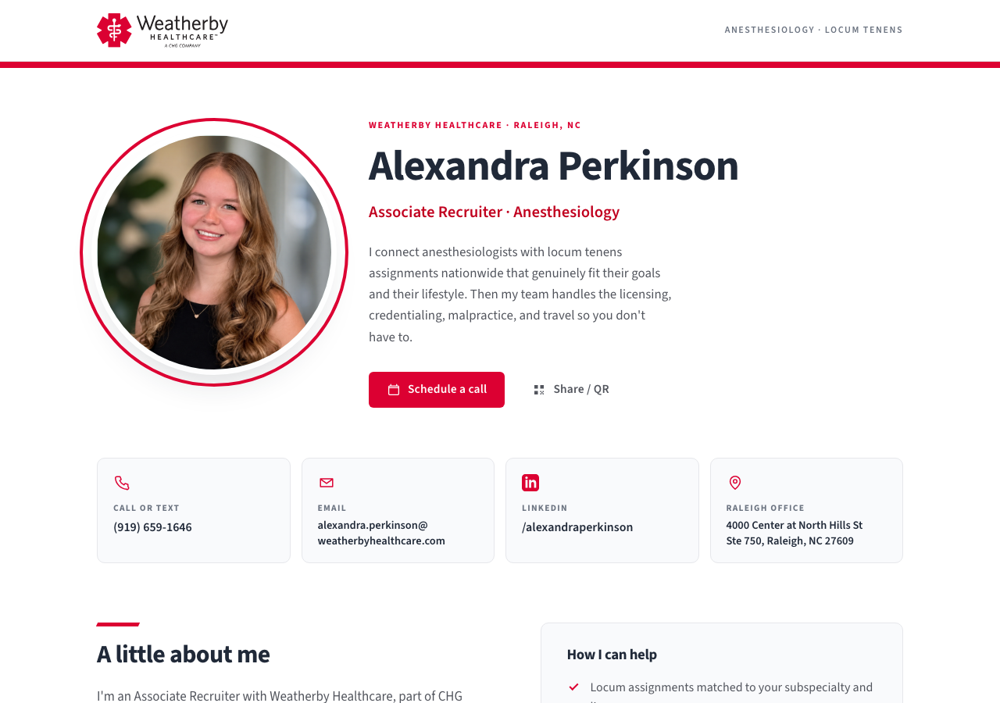
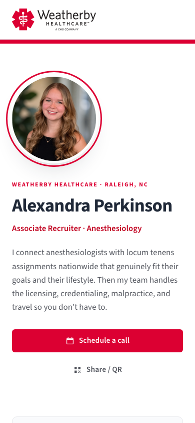

# Ally Perkinson — digital business card

A one-page contact card for Alexandra Perkinson (Associate Recruiter,
Anesthesiology at Weatherby Healthcare) — built to drop in an email
signature, a text, or a QR code on a conference badge. Static HTML/CSS/JS,
no build step, no dependencies, no framework. Deploys to GitHub Pages as-is
and loads instantly.

**Live:** https://allyperkinson.com

<p>
  
</p>

<table>
<tr><td width="240" valign="top">
  
</td>
<td valign="top">

Fully responsive down to a single phone-width column — the layout stacks,
the hero photo shrinks, and the contact tiles go full-width. Breakpoints
at 900px, 700px, and 460px (`styles.css:387-407`).

</td></tr>
</table>

## Table of contents

- [What's on the page](#whats-on-the-page)
- [Tech stack](#tech-stack)
- [File structure](#file-structure)
- [Preview locally](#preview-locally)
- [Personalizing the content](#personalizing-the-content)
- [Scheduling embed](#scheduling-embed)
- [Deploy to GitHub Pages](#deploy-to-github-pages)
- [Custom domain](#custom-domain)
- [Brand notes](#brand-notes)
- [Accessibility & performance](#accessibility--performance)
- [License](#license)

## What's on the page

- **Hero** — photo, name, title, one-line pitch, and two calls to action.
- **Schedule a call** — opens her live booking link (Sense scheduler) in a
  new tab.
- **Share / QR** — on a phone, opens the native share sheet; on desktop,
  opens a dialog with a scannable QR code that links to the page, her
  contact details, and a "copy link" button. Her name, phone, and email are
  also copied straight to the clipboard the moment the dialog opens.
- **Contact tiles** — call/text (`tel:`), email (`mailto:`), LinkedIn, and
  a Google Maps link to her office, each a tap target on its own.
- **About** — a short bio plus a "How I can help" checklist and a link to
  open anesthesiology assignments.
- **Scheduling section** — the same booking link embedded inline as an
  `<iframe>`, so a visitor can pick a time without leaving the page.
- **Footer** — Weatherby logo/links and a trademark-attribution line.

None of this needs a server: `main.js` reads its data straight out of the
markup (name, title, phone, email, canonical URL), so there's no separate
config file to keep in sync.

## Tech stack

Plain HTML, CSS, and vanilla JS. No React, no bundler, no `package.json`.
The only runtime dependency is loaded on demand, client-side:

- [`qrcode-generator`](https://github.com/kazuhikoarase/qrcode-generator) via
  jsDelivr CDN — fetched only when someone opens the Share / QR dialog.
- [Google Fonts](https://fonts.google.com/specimen/Source+Sans+3) —
  Source Sans 3, preconnected in `<head>`.

Everything else — the schema.org `Person` structured data, Open Graph
tags, the responsive grid, the QR dialog, the scheduling iframe — is
hand-rolled.

## File structure

```
.
├── index.html              single page: markup, meta tags, ld+json
├── main.js                 year stamp, scheduling embed, share/QR, copy-link
├── styles.css               design tokens, layout, responsive + print rules
├── serve.sh                 local static server (python3 -m http.server)
├── CNAME                    custom domain for GitHub Pages
├── .nojekyll                 tells Pages to skip Jekyll processing
├── docs/
│   └── screenshots/          images used in this README
└── assets/
    ├── ally.jpg               her photo (hero + QR dialog + og:image)
    ├── wby_logo.svg           Weatherby logo (topbar + footer)
    ├── footer-logo.svg        alternate footer mark (currently unused)
    ├── favicon.ico
    ├── favicon-16x16.png
    ├── favicon-32x32.png
    ├── apple-touch-icon.png
    └── safari-pinned-tab.svg
```

## Preview locally

```bash
./serve.sh          # → http://localhost:4000
```

Use the server rather than opening `index.html` directly via `file://` —
some browsers block the scheduling iframe and clipboard APIs under the
`file://` origin. `serve.sh` just wraps `python3 -m http.server`, binding to
`127.0.0.1` so nothing else on the network can reach it; pass a port to
override the default:

```bash
./serve.sh 5173     # → http://localhost:5173
```

## Personalizing the content

Everything editable lives in `index.html`, flagged with `EDIT:` comments —
useful if you're cloning this for someone else. Current values:

| # | What | Where | Current value |
|---|------|-------|----------------|
| 1 | Canonical domain — `canonical` + `og:url` + `og:image` | `<head>` | `https://allyperkinson.com/` |
| 2 | Photo | `assets/ally.jpg` | her real photo |
| 3 | Direct phone — `tel:` + visible text + `ld+json` | contact tile | `(919) 659-1646` |
| 4 | Work email — `mailto:` + visible text + `ld+json` | contact tile | `alexandra.perkinson@weatherbyhealthcare.com` |
| 5 | Scheduling link (hero button) | hero CTA | `https://snshqsc.co/vJAcd0` |
| 6 | Scheduling link (inline embed, same URL) | scheduling section | `https://snshqsc.co/vJAcd0` |

Phone and email each appear in two places — once as a visible tile, once
in the `application/ld+json` block near the bottom of `index.html` — so
search results and rich link previews match what's on the page. Update
both if either changes.

Also worth a glance if anything about her role changes:

- **Job title** — her LinkedIn headline says "Associate Consultant," her
  experience entry says "Associate Recruiter." The page uses *Associate
  Recruiter · Anesthesiology* (the official job-title field). If Weatherby
  uses "Consultant" with clients, update the `.role` line in the hero and
  `jobTitle` in the `ld+json` block.
- **Subspecialty focus** — the "How I can help" list is a reasonable guess
  at desk coverage, not confirmed against her actual book of business.

## Scheduling embed

Paste a scheduling link (Calendly, Microsoft Bookings, Sense, or anything
else that isn't framebusted) into the two `EDIT: 5/6` spots and `main.js`
embeds it inline as an `<iframe>` — no third-party script required:

```js
// main.js — schedule__embed handling
const embed = $('.schedule__embed');
const src = embed.dataset.embedSrc || '';
if (src && !PLACEHOLDER.test(src)) { /* build and mount the iframe */ }
```

Calendly links get two extra query params (`embed_domain`, `embed_type`)
so their widget renders inline instead of assuming a popup. Every other
host — including the Sense scheduler currently in use — is embedded as-is.

While the URL still matches the placeholder pattern
(`/your-link|555-?123-?4567|\(555\)/i` in `main.js`), the section shows a
plain "Email me instead" button instead of a broken iframe, so the page
never looks unfinished mid-edit.

If a future scheduling provider blocks framing (`X-Frame-Options` /
`frame-ancestors`), the iframe will render blank — check the provider's
embed docs, or fall back to a plain link-out button instead of the embed.

## Deploy to GitHub Pages

```bash
git init && git add -A && git commit -m "Ally's contact card"
gh repo create ally-perkinson --public --source=. --push
```

Then **Settings → Pages → Source: Deploy from a branch → `main` / `(root)`**.

> **Private repos:** GitHub Pages only serves from a private repository on
> GitHub Pro, Team, or Enterprise plans. On a free personal account, the
> repo needs to be **public** for Pages to build at all.

`.nojekyll` is already in the repo root — GitHub Pages runs content
through Jekyll by default, which ignores files/folders starting with `_`
and can mangle a hand-rolled static site. This file turns that off.

### Custom domain

1. The domain is already set in `CNAME` (`allyperkinson.com`). Delete the
   file if you'd rather use the default
   `<user>.github.io/ally-perkinson` URL.
2. At your registrar, for the apex domain add four `A` records:
   `185.199.108.153`, `185.199.109.153`, `185.199.110.153`,
   `185.199.111.153` (or a single `ALIAS`/`ANAME` record to
   `<user>.github.io`, if your registrar supports it).
   For `www`, add one `CNAME` record → `<user>.github.io`.
3. **Settings → Pages → Custom domain**, then tick **Enforce HTTPS** once
   the certificate provisions (usually under an hour, sometimes up to 24).

Before any of this works, the domain has to actually be registered and
delegated — a fresh domain purchase can take a little while to propagate
before its nameservers resolve at all. Check with:

```bash
dig +short allyperkinson.com A
```

An empty result (or NXDOMAIN) means the domain isn't pointed anywhere yet
— that's a registrar/DNS issue, not a GitHub Pages one.

## Brand notes

Colors and the logo come from Weatherby's own stylesheet
(`app-BfoPyvSX.css`):

| Token | Hex | Used for |
|---|---|---|
| `--red` | `#dc0032` | primary buttons, links, accent rule |
| `--red-dark` | `#c1001f` | hover state |
| `--ink` | `#202938` | headings, body text |
| `--maroon` | `#a03058` | secondary accent |
| `--mint` | `#74c9b9` | secondary accent |

The diagonal wedge behind the hero photo is Weatherby's "angle" motif,
rebuilt in CSS because their own SVG endpoints return 500.

Weatherby licenses **Whitney** (Hoefler & Co) locked to their own domain,
so it can't be reused here. The font stack asks for Whitney first and
falls back to **Source Sans 3**, the closest free humanist match.

**Trademark note:** Weatherby/CHG may have policies about employees using
the corporate logo on a personal site. The footer already carries an
attribution line (`© … Weatherby Healthcare is a division of CHG
Healthcare. The Weatherby name and logo are trademarks of their
respective owner…`), but it's worth a quick check with her manager or
marketing team before this link goes in an email signature.

## Accessibility & performance

- Skip-to-content link, semantic landmarks (`header`/`main`/`footer`/
  `nav`), and a native `<dialog>` for the QR modal (focus-trapped and
  `Esc`-closable for free).
- `@media (prefers-reduced-motion: reduce)` disables the wedge/photo
  transitions for anyone who's asked for that (`styles.css:409`).
- A dedicated `@media print` stylesheet strips chrome for anyone who
  prints the page (`styles.css:415`).
- No web fonts block first paint of text — `font-display: swap` via the
  Google Fonts `display=swap` param.
- Everything is static and same-origin except the scheduling iframe, the
  Google Fonts stylesheet, and the on-demand QR script — so there's very
  little to go wrong offline; the QR flow specifically degrades to a
  "copy link" prompt if that script fails to load.

## License

Personal site for Alexandra Perkinson. Not licensed for reuse as-is (it
carries her name, photo, and contact details, and Weatherby's branding).
Feel free to use the structure/approach as a reference for a similar
one-page contact card of your own.
